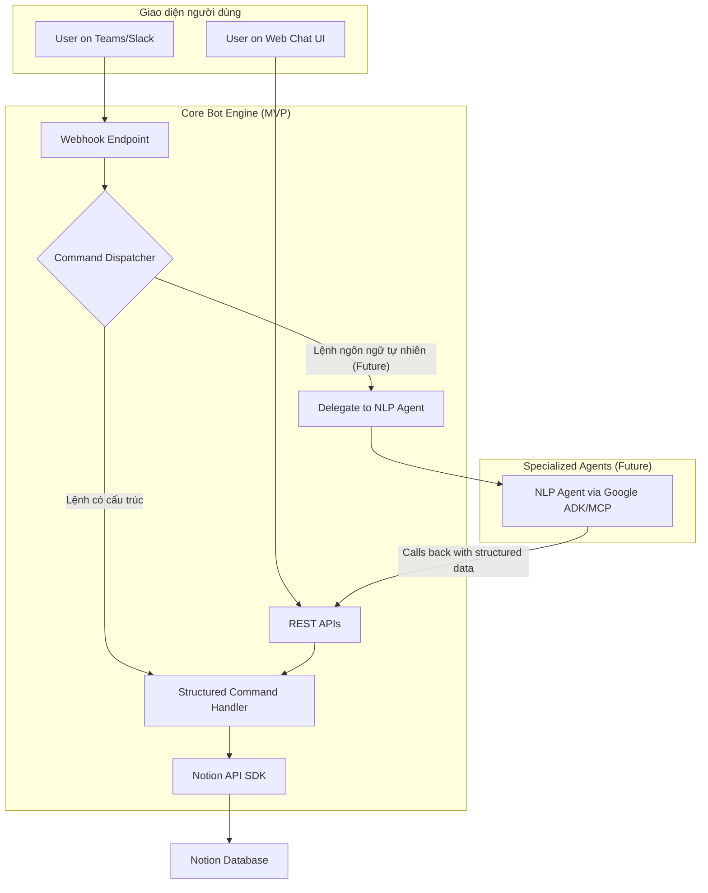

Dưới đây là **PRD (Product Requirements Document) chi tiết** cho dự án “Bot quản lý task tập trung, tích hợp Notion API, giao tiếp đa nền tảng (Teams/Slack/…) thông qua API và Webhook”.

***

### 1. Mục tiêu dự án

- Xây dựng một backend bot tập trung, cung cấp các API quản lý task (CRUD) dựa trên Notion database.
- Cho phép các nền tảng chat (Teams, Slack, Discord, Telegram...) giao tiếp với bot thông qua API hoặc webhook, giúp tạo, tra cứu, cập nhật trạng thái và nhận thông báo task ngay trong ứng dụng chat.
- Đảm bảo khả năng mở rộng (scalable), bảo mật, linh hoạt khi tích hợp và quản lý trên nhiều workspace/page Notion, **chuẩn bị sẵn kiến trúc để tích hợp các agent AI (Google ADK) trong tương lai.**

***

### 2. Đối tượng sử dụng

- **Nhân viên:** Muốn thao tác nhanh (tạo, cập nhật, xem) task Notion mà không cần rời khỏi ứng dụng chat hàng ngày.
- **Leader/Quản lý dự án:** Cần một cách nhanh chóng để giao việc, kiểm tra tiến độ và nhận báo cáo tổng hợp từ Notion ngay trên nền tảng giao tiếp của team.
- **DevOps/IT:** Cần tự động hóa workflow (ví dụ: tự động tạo task khi có lỗi trên hệ thống) hoặc muốn xây dựng các rule thông báo/nhắc nhở tùy chỉnh.

***

### 3. Tính năng chính (Functional Requirements)

**A. Core Bot Backend: API & Webhooks**

- **RESTful API Endpoints:**
    - `POST /tasks`: Tạo task mới.
        - **Payload:** `{ "title": "string (required)", "notion_database_id": "string (required)", "assignee_id": "string", "due_date": "datetime", "priority": "string", "properties": {} }`
        - **Response:** `{ "notion_task_id": "string", "notion_task_url": "string" }`
    - `GET /tasks`: Lấy danh sách task.
        - **Query Params:**
            - **Filtering:** `status`, `assignee`, `due_date_from`, `due_date_to`, `project_id`.
            - **Pagination:** `page` (default: 1), `limit` (default: 20).
            - **Sorting:** `sort_by` (e.g., `due_date`), `order` (`asc` or `desc`).
    - `PATCH /tasks/{id}`: Cập nhật một task.
        - **Payload:** Chỉ chứa các trường cần cập nhật, ví dụ: `{ "status": "Done" }`.
    - `DELETE /tasks/{id}`: Xoá một task.
    - `GET /projects`: Lấy thông tin project, mapping Notion page/database.

- **Webhook Endpoint:**
    - Thiết kế một endpoint chung: `POST /webhooks/{platform}` (e.g., `/webhooks/teams`, `/webhooks/slack`).
    - Bot cần nhận dạng các cấu trúc command. **Lưu ý: Trong phiên bản MVP, bot sẽ tập trung vào các lệnh có cấu trúc (structured commands) thay vì xử lý ngôn ngữ tự nhiên phức tạp (NLP).**
    - Ví dụ về lệnh có cấu trúc:
        - Slash command: `/task create title:"Fix login bug" assignee:@userA due:tomorrow`
        - Slash command: `/task list status:open`
    - Người dùng vẫn có thể input ngôn ngữ tự nhiên, nhưng ở giai đoạn MVP, bot có thể phản hồi rằng tính năng này chưa được hỗ trợ và hướng dẫn sử dụng lệnh có cấu trúc.

- **User & Workspace Mapping:**
    - Cần một hệ thống (database) để map `user_id` trên Teams/Slack với `user_id` trên Notion.
    - Cung cấp cơ chế (qua API `POST /config` hoặc file cấu hình) để admin/người dùng thiết lập `database_id` của Notion sẽ được sử dụng cho một kênh chat hoặc project.

**B. Quản lý bảo mật & Xác thực**

- **API Key:** Dành cho các hệ thống bên ngoài (server-to-server) gọi vào. Mỗi key được cấp phát cần có scope (quyền) rõ ràng (read-only, read-write).
- **OAuth 2.0:** Luồng xác thực chính cho người dùng cuối. Khi một team cài đặt bot, admin sẽ thực hiện luồng OAuth để cấp quyền cho bot truy cập vào workspace/database Notion của họ. Access token và refresh token phải được lưu trữ an toàn trong database.
- **Xác thực Webhook:** Sử dụng cơ chế HMAC/secret key để đảm bảo các request đến webhook endpoint là từ một nguồn đáng tin cậy (Teams, Slack...).

**C. Rule Engine và Automation**

- Cho phép người dùng/admin định nghĩa các rule tự động hóa. Mỗi rule được định nghĩa bằng cấu trúc (ví dụ: JSON/YAML) và quản lý qua API (`GET, POST, PATCH, DELETE /rules`).
- **Ví dụ cấu trúc rule:**
  ```yaml
  - name: "Daily morning summary"
    trigger:
      type: "schedule"
      cron: "0 9 * * 1-5" # 9h sáng mỗi ngày từ T2-T6
    action:
      type: "post_message"
      platform: "teams"
      channel_id: "channel-abc"
      message_template: "Good morning! Here are today's pending tasks: {{tasks}}"
    filter: # Lọc các task để đưa vào message
      status: "In Progress"
  ```

**D. Logging & Tracking**

- Ghi lại lịch sử các thao tác quan trọng (ai đã tạo/cập nhật/xóa task, thời gian nào).
- Sử dụng structured logging (JSON format) để dễ dàng truy vấn và phân tích trên các hệ thống như ELK, Datadog.

***

### 4. Giao tiếp với nền tảng bot/chat

- **Mô hình Adapter:** Áp dụng "Adapter Pattern". Core logic của bot sẽ xử lý dữ liệu thuần túy. Một lớp Adapter cho mỗi nền tảng (e.g., `TeamsAdapter`, `SlackAdapter`) sẽ chịu trách nhiệm định dạng message trả về theo chuẩn của nền tảng đó (Adaptive Cards cho Teams, Block Kit cho Slack).
- **Tương tác nâng cao:** Bot phải hỗ trợ các thành phần UI tương tác:
    - **Buttons:** "Mark as Done", "Change Status".
    - **Dropdowns/Selects:** Chọn priority, chọn người được giao việc.
    - Bot cần xử lý các callback event một cách bất đồng bộ khi người dùng tương tác với các thành phần này.

***

### 5. Công nghệ dự kiến

- **Frontend (Web Chat UI for MVP):** HTML/CSS/JavaScript đơn giản, hoặc React/Vue để dễ mở rộng.
- **Backend (MVP):** Python (FastAPI) hoặc Node.js (Express/NestJS).
- **Notion API SDK:** `notion-sdk-py` / `@notionhq/client`.
- **Database:** NoSQL Document Database.
        - **Local/MVP:** MongoDB (chạy qua Docker).
        - **Cloud/Production:** MongoDB Atlas (để chuyển đổi liền mạch) hoặc Google Firestore (nếu cần tích hợp sâu với hệ sinh thái Firebase).
- **Caching:** Redis để cache dữ liệu từ Notion, giảm thiểu API call và tuân thủ rate limit.
- **Bảo mật API:** JWT, OAuth 2.0, HMAC.
- **Deployment:** Docker, Kubernetes, hoặc các nền tảng PaaS (Azure, AWS, Heroku).
- **Kiến trúc mở rộng (Future):** Google ADK (Agent Development Kit), Google Cloud AI Platform, MCP (Model-Centric Platform).

***

### 6. Tổng quan kiến trúc (Architecture Overview)

Hệ thống sẽ được thiết kế theo kiến trúc module hóa để đảm bảo khả năng mở rộng và tích hợp trong tương lai.



- **Core Bot Engine (MVP):**
    - Chịu trách nhiệm nhận request từ các nền tảng chat (qua Webhook), xác thực.
    - **Command Dispatcher:** Phân loại request. Nếu là lệnh có cấu trúc (e.g., `/task create ...`), nó sẽ được xử lý trực tiếp bởi **Structured Command Handler**.
    - **Structured Command Handler:** Thực thi các logic CRUD (Create, Read, Update, Delete) bằng cách gọi Notion API.
    - Cung cấp các **RESTful API** để các hệ thống khác (hoặc chính các agent và Web Chat UI) có thể tương tác.

- **Web Chat UI (MVP):**
    - Một giao diện web chat đơn giản, cho phép người dùng nhập lệnh và nhận kết quả trực tiếp.
    - Giao diện này sẽ gọi thẳng đến các **RESTful API** của Core Bot Engine.
    - **Mục tiêu:** Dùng để thử nghiệm nhanh các tính năng và logic của API mà không cần thông qua một nền tảng chat hoàn chỉnh.

- **Specialized Agents (Future - via Google ADK):**
    - **NLP Agent:** Trong các phiên bản sau, khi người dùng nhập một câu lệnh tự nhiên (e.g., `"tạo cho tôi một task để fix bug login vào ngày mai"`), Command Dispatcher sẽ không xử lý mà ủy quyền (delegate) cho một Agent chuyên biệt được xây dựng bằng **Google ADK**.
    - Agent này (sử dụng một **MCP Notion Tool**) sẽ phân tích câu nói, trích xuất thông tin (intent, entities) và gọi lại vào các RESTful API của **Core Bot Engine** để thực thi yêu cầu.
    - Kiến trúc này giúp tách biệt logic nghiệp vụ cốt lõi khỏi phần xử lý AI/NLP phức tạp, dễ dàng nâng cấp và bảo trì.

***

### 7. Yêu cầu phi chức năng (Non-Functional Requirements)

- **Hiệu năng (Performance):**
    - Thời gian phản hồi trung bình của API dưới 500ms.
    - Thời gian bot xử lý và gửi phản hồi trong chat app dưới 3 giây.
- **Khả năng mở rộng (Scalability):**
    - Hệ thống có thể xử lý đồng thời ít nhất 100 request/giây.
    - Kiến trúc module hóa cho phép dễ dàng thêm tích hợp cho một nền tảng chat mới mà không ảnh hưởng đến các nền tảng hiện có.
- **Độ tin cậy (Reliability):**
    - Uptime của hệ thống phải đạt 99.9%.
    - Sử dụng message queue (RabbitMQ, SQS) để xử lý webhook, đảm bảo không làm mất request ngay cả khi Notion API hoặc các dịch vụ khác bị lỗi tạm thời.
- **Bảo mật (Security):**
    - Tất cả các thông tin nhạy cảm (secret, API key, token) phải được mã hóa khi lưu trữ (at-rest) và khi truyền đi (in-transit).
    - Dữ liệu nhạy cảm không được log ra file text.
- **Giới hạn (Rate Limiting):**
    - Áp dụng rate limit cho các API endpoint để tránh bị lạm dụng.
    - Bot phải có cơ chế tự điều chỉnh để tuân thủ rate limit của Notion API và các nền tảng chat.

***

### 8. Tiêu chí nghiệm thu

- Thao tác đầy đủ task (CRUD) trên Notion thông qua các RESTful API đã định nghĩa.
- Bot gửi/nhận và phản hồi tương tác từ chat app (MS Teams và Slack) qua webhook/API trong thời gian thực (< 3 giây).
- Notification và Rule Engine hoạt động đúng theo cấu hình đã thiết lập.
- Hệ thống đáp ứng các yêu cầu phi chức năng về hiệu năng và độ tin cậy dưới tải mô phỏng.
- Có tài liệu API (Swagger) và tài liệu hướng dẫn cài đặt, sử dụng bot.

***

### 9. Lộ trình phát triển (Milestones)

- **Phase 0: Thiết kế & Chuẩn bị (Sprint 0)**
    1.  Hoàn thiện PRD chi tiết.
    2.  Thiết kế API Contract bằng OpenAPI (Swagger).
    3.  Thiết kế cấu trúc database chi tiết (schema cho users, workspaces, rules, notion_mappings).
    4.  Setup môi trường dev, staging và CI/CD pipeline.

- **Phase 1: Xây dựng Lõi (MVP)**
    1.  **Setup Database & Models:** Kết nối tới MongoDB và định nghĩa các data model (User, Workspace, Rule) trong code.
    2.  **Implement Core Task APIs:** Xây dựng các API CRUD cho `/tasks`, bao gồm cả logic sử dụng Notion SDK.
    3.  **Build Simple Web Chat UI:** Với API đã có, xây dựng giao diện web chat đơn giản để test và demo.
    4.  **Implement Webhook Endpoint:** Xây dựng webhook để nhận sự kiện từ các nền tảng bên ngoài.
    5.  **Build First Platform Adapter (Teams):** Tích hợp với MS Teams, xử lý lệnh có cấu trúc và định dạng phản hồi.

- **Phase 2: Hoàn thiện & Bảo mật**
    1.  **Implement OAuth 2.0 Flow:** Cho phép người dùng kết nối tài khoản Notion một cách an toàn.
    2.  **Start Rule Engine Development:** Xây dựng API và logic cơ bản cho Rule Engine.
    3.  **Integrate Logging & Monitoring:** Tích hợp structured logging và các công cụ giám sát.
    4.  **Build Second Platform Adapter (Slack):** Mở rộng hỗ trợ sang Slack.

- **Phase 3: Mở rộng & Tối ưu**
    - **Mở rộng Tính năng:**
        1.  **Expand Rule Engine:** Hoàn thiện Rule Engine với nhiều loại trigger và action phức tạp hơn.
        2.  **Integrate NLP Agent (Google ADK):** Tích hợp Agent AI để xử lý các câu lệnh ngôn ngữ tự nhiên.
    - **Mở rộng Nền tảng & Hiệu năng:**
        3.  **Optimize Performance with Caching:** Tích hợp Redis để giảm tải và tăng tốc độ phản hồi.
        4.  **Expand to More Platforms:** Tích hợp các nền tảng khác như Discord, Telegram...
    - **Hoàn thiện cho Production:**
        5.  **Finalize Documentation:** Hoàn thiện tài liệu hướng dẫn sử dụng và API docs.
        6.  **Security & Performance Testing:** Thực hiện kiểm thử chuyên sâu về bảo mật và tải.
***
